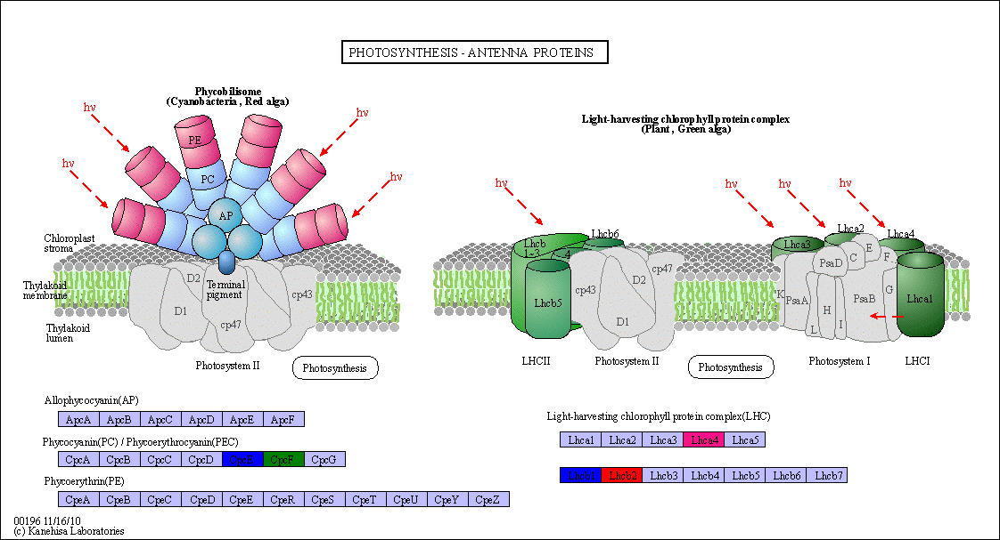
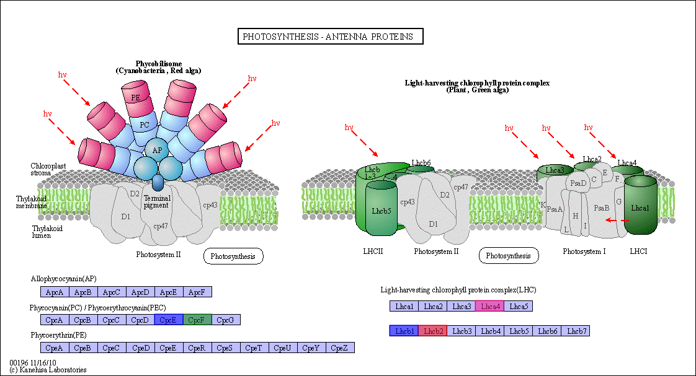

# Generate Highlighted SVG/PNG for KEGG Pathway

## Installation
```bash
pip install kegg_viewer
```


## Examples
```bash
kegg_viewer -h
kegg_viewer -p ko00196
kegg_viewer -p ko00196,ko00197
kegg_viewer -p path.list
kegg_viewer -p path.list -g gene.list -c ./cache -O output
kegg_viewer -p path.list -g gene.list -m online
kegg_viewer -p path.list -g gene.list -t png
kegg_viewer -p path.list -g gene.list -t both
```

### genelist examples
```
K08913	red
K08912	blue
LAMA2	blue
K02289	red
K20713	blue
K08910	#FF1188
```

### example results
**png mode**

**svg mode**


### SVG Mode:
- `local`    # use local image as background
- `online`   # use online image as background
- `base64`   # convert background to base64, ***default and recommend!***

## TODOs
- add list, link method for KEGGRest
- prepare cache data(png/conf) for input organism